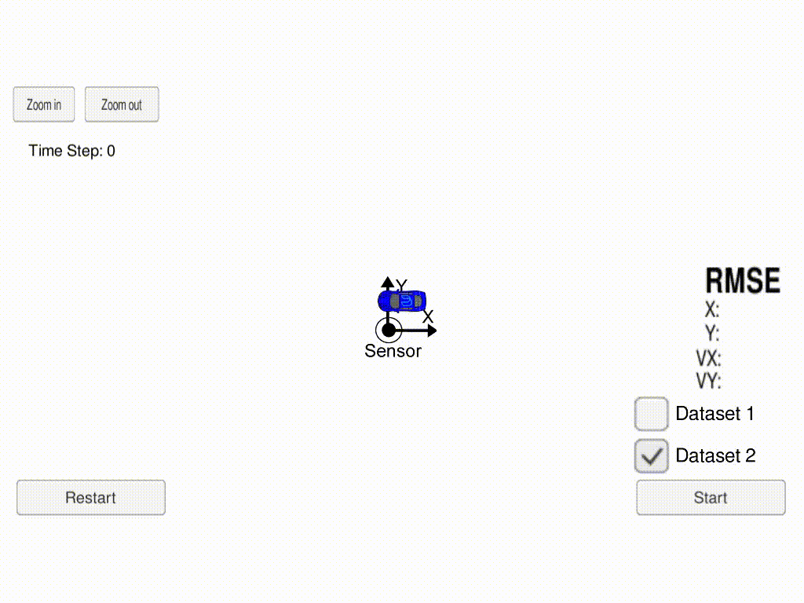

# Project: Extended Kalman Filter Project

In this project we will utilize a Kalman filter to estimate the state of a moving object of interest with noisy lidar and radar measurements

[//]: # (Image References)

[image1]: ./readme_data/EKF_process.JPG "EKF Process"

Overview
-------

**What is Kalman Filter and Extended Kalman Filter ?**

![EKF Process][image1]

Kalman filter is used in any place where you have uncertain information about some dynamic system, and you can make an educated guess about what the system is going to do next. Kalman filters are ideal for systems which are continuously changing. They have the advantage that they are light on memory (they don’t need to keep any history other than the previous state), and they are very fast, making them well suited for real time problems and embedded systems.

While Kalman Filter applied we need to assume :
1. that both variables (position and velocity, in our case) are random and Gaussian distributed.
2. functions involved are Linear functions (for prediction and update step)

but in real life, prediction and update step might contain non-Linear Functions . To tackle with this situation we use Extended Kalman Filter.

Extended Kalman Filter makes the non linear function into linear function using Taylor Series , it helps in getting the linear approximation of a non linear function. We preferably use Jacobian Matrix for 1st order partial derivatives.

#### Final Output

The red and blue signs displays Lidar RADAR data.
The green one's displays the updated position after predicting and utilizing Lidar and RADAR data.

### Environment Details

This Project is built on Linux.

This repository includes two files that can be used to set up and install [uWebSocketIO](https://github.com/uWebSockets/uWebSockets) for either Linux or Mac systems. For windows you can use either Docker, VMware, or even [Windows 10 Bash on Ubuntu](https://www.howtogeek.com/249966/how-to-install-and-use-the-linux-bash-shell-on-windows-10/) to install uWebSocketIO.

Once the install for uWebSocketIO is complete, the main program can be built and run by doing the following from the project top directory.

1. Clone this repo.
2. Make a build directory: `mkdir build && cd build`
3. Compile: `cmake .. && make`
   * On windows, you may need to run: `cmake .. -G "Unix Makefiles" && make`
4. Run it: `./ExtendedKF `

### Simulator Details

Download Simulator from [here](https://github.com/udacity/self-driving-car-sim/releases/)

### Input
values provided by the simulator to the c++ program

["sensor_measurement"] => the measurement that the simulator observed (either lidar or radar)

### Output
values provided by the c++ program to the simulator

["estimate_x"] <= kalman filter estimated position x

["estimate_y"] <= kalman filter estimated position y

["rmse_x"]

["rmse_y"]

["rmse_vx"]

["rmse_vy"]

---

## Other Important Dependencies

* cmake >= 3.5
  * All OSes: [click here for installation instructions](https://cmake.org/install/)
* make >= 4.1 (Linux, Mac), 3.81 (Windows)
  * Linux: make is installed by default on most Linux distros
  * Mac: [install Xcode command line tools to get make](https://developer.apple.com/xcode/features/)
  * Windows: [Click here for installation instructions](http://gnuwin32.sourceforge.net/packages/make.htm)
* gcc/g++ >= 5.4
  * Linux: gcc / g++ is installed by default on most Linux distros
  * Mac: same deal as make - [install Xcode command line tools](https://developer.apple.com/xcode/features/)
  * Windows: recommend using [MinGW](http://www.mingw.org/)
